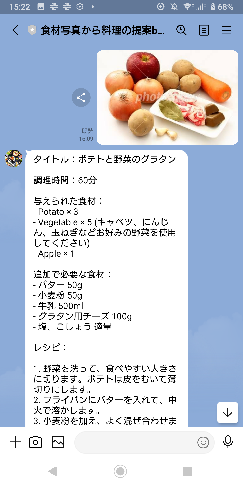

# LINEbot_recipeGPTbyPhoto
## 機能
- 食材の写真をLINEに送ると、それらの食材を使った料理のレシピを提案してくれます。
- 加えて、レシピ内容から予想される料理の完成画像を生成します。

## 動作例
### 例1
入力→出力

    
    

### 例2
入力→出力

    
    

## 使用方法
1. LINE Developersに登録しMessageAPIの設定を行う
2. GASのプロパティに LINE botのチャンネルアクセストークン、OpenAIのAPI Key、Cloud Vision API keyを設定する
